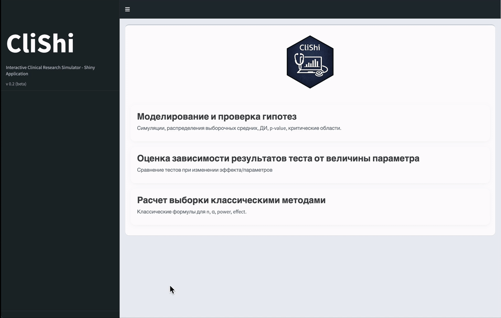

# CliShi 

Interactive **Cli**nical Research Simulator - **Shi**ny Application. The simulator serves as a platform for learning important statistical concepts and interactive software for performing common clinical research tasks

## Contents

- [Motivation](#motivation)
- [Blocks](#blocks) 
	- [Block 1. Hypothesis Modeling and Testing](#block-1-hypothesis-modeling-and-testing)
	- [Block 2. Evaluation of test results dependence on parameter values](#block-2-evaluation-of-test-results-dependence-on-parameter-values)
	- [Block 3. Sample size calculation using classical methods](#block-3-sample-size-calculation-using-classical-methods)  
	*New blocks are planned to be added...*
- [Future plans](#future-plans)


- [Requirements](#requirements)
- [Download the app](#download-the-app)
- [Install dependencies](#install-dependencies)

## Motivation

- Researchers often do not code in R
- Interactive and visual approach makes easier to understand main statistical concepts
- Modelling clinical trials is an easy and effective way to explore statistical methods without having a real data
- Educational purposes: visual explanation of complex statistical ideas

**[Shiny]() allows to create interactive applications to make statistical decisions easier, visually and without coding**

## Blocks

### Block 1. Hypothesis Modeling and Testing

<p align="center">
  
</p>

The first block is designed for modelling and testing statistical hypotheses. It allows you to see how sample means, confidence intervals, and p-values change when certain parameters are modified. The parameters are set in the sidebar: distribution type, mathematical expectation, sample size, and number of simulations, hypothesis, confidence level, and significance level.

**This block includes five tabs:**

1. The first tab presents the t-test results for a ***single generated sample***. It displays the observations, sample mean, and confidence interval, indicating whether the confidence interval covers both the true and hypothetical mean. Below, the numerical results and the decision on whether to reject the null hypothesis are provided. 

2. This tab shows the distribution of sample means when the experiment is repeated multiple times. <!--???--> When the true mean coincides with the hypothetical value, the distribution of sample means is centred around it. When the true mean differs, the distribution remains centred around the true value and is shifted relative to the hypothetical mean. <!--???-->

3. Here you can see the behaviour of confidence intervals in a series of repeated experiments. <!--???--> When the null hypothesis is true, most intervals cover the hypothetical value, and the rare cases of non-coverage correspond to a type I error. When the true mean differs from the hypothetical mean, the proportion of intervals that do not cover this value increases, leading to more frequent rejection of the null hypothesis. <!--???-->

4. On this tab the distribution of p-values is showed. <!--???--> When the null hypothesis is true, p-values are distributed approximately uniformly from 0 to 1. When the null hypothesis is false, p-values tend to be small and skewed towards zero. <!--???-->

5. Help tab, where you can find information about selected disribution and simulation structure.


### Block 2. Evaluation of test results dependence on parameter values

<p align="center">
  
</p>

The functionality of the second block allow simulating thousands of experiments and studying the dependence of Type 1 and Type 2 errors on various parameters. For each test you can select parameter and specify the grid *(from, to, by)* to iterate over. On each step N samples are generated, thus **simulation may take a long time**. **You can specify number of CPUs for simulation for faster computation.**

Parallel computation is implemented using `furrr` and `future` packages

|**Number of CPUs used** |   1  |   2  |   3  |   4  |   5  |   6  |  7  |
|:-----------------------:|:----:|:----:|:----:|:----:|:----:|:----:|:---:|
|  **Simulation time of Chi-Square test**<br>(29 steps grid, 10000 samples), s | 49.5 | 30.6 | 22.6 | 18.9 | 16.5 | 15.5 |  14 |
| **Simulation time Brunner-Munzel test**<br>(9 steps grid, 1000 samples), s | 25 | 14.3 | 11.4 | 10.8 |  8.5 |  8.6 | 9.3 |

*Tested on 11th Gen Intel(R) Core(TM) i7-11800H @ 2.30GHz, 8 cores. OS: Windows*

#### *Examples:*

+ Compare the stability (Type I error) of Mann-Whitney and Brunner-Muzel tests to the difference in variances (SD) of two compared samples <!--*(the second one is more stable)*-->
+ See Type I error dependence on non-normally distributed samples size when using t-test
+ See sensitivity (Type I error) of the chi-square test to events with very low probabilities

### Block 3. Sample size calculation using classical methods

<p align="center">
  
</p>

This section helps to calculate sample size using classical methods.
For our application, we used the `TrialSize` (ver. 1.4.1) and two main functions: `TwoSampleProportion` and `TwoSampleMean`. 

You can calculate sample size for both non-inferiority and superiority hypotheses types. You can specify the data type in the sidebar: whether it is quantitative or qualitative and so determine which formula will be used. The application displays text you can copy by clicking on the button and paste into your synopsis.

## Future plans
+ Sequential/adaptive designs  
+ Bioequivalence studies  
+ Survival analysis  
+ Longitudinal studies  
+ Regression modeling (linear, logistic, Cox)  

## Requirements

-   R (\>= 4.5 recommended)
-   Internet access for first-time package installation

## Download the app

Option A: Clone with Git:

``` bash
git clone https://github.com/BIOSTAT/CLISHI_PROJECT.git
cd CLISHI_PROJECT
```

Option B: Download a ZIP:

1. Go to the GitHub repository page.
2. Click **Code** → **Download ZIP**.
3. Unzip the archive and open the folder in R.

## Install dependencies

From the project root in R:

``` r
source("install.R")
```

## Run the app

From the project root in R:

``` r
shiny::runApp("app.R")
```

## Project structure

-   `app.R` - main Shiny app entry point
-   `scripts/` - modular code for UI, calculations, and plots
-   `www/` - static assets (CSS/JS/images)
-   `install.R` - installs required R packages

## Troubleshooting

-   If you see missing-package errors, rerun `source("install.R")`.
-   If a CRAN mirror is required, set one before installing:

``` r
options(repos = c(CRAN = "https://cloud.r-project.org"))
```

## Authors

-   [Bektur Berdibekov](https://github.com/BekturBerdibekov)
-   [Danil Tukanov](https://github.com/DataDaniel010)
-   [Daria Kuznetcova](https://github.com/daria-kuznetcova)
-   [Mariia Akhmetova](https://github.com/Hemofixic)
-   [Vladislav Stanin](https://github.com/vladissta)
-   [Evgeny Bakin](https://github.com/evgeny-bakin)
